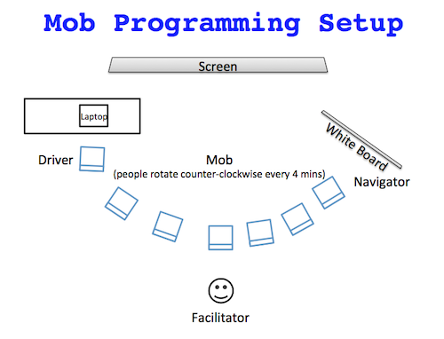

# 1st Time Mob Programming Facilitor's Guide
By [@LlewellynFalco](https://twitter.com/llewellynfalco)


This is a short guide to facilitating your 1st Mob Programming session with your team. Facilitating a mob is a separate skill, and does not require any prior technical expertise. 

## Picking the problem  
The goal in the beginning should be to do something simple 
and have fun learning to mob. As such, you should start with an easy problem.   
 
How do you know if the problem is easy enough?  
Ask your developers if they believe they can solve this problem alone in under an hour. 

If you are new to mobbing, it's best to start with a simple exercise, not a work task.
It is ok to take a simple task from your workload, just start very small. No, smaller.

If you want a simple exercise, [The FizzBuzz kata](http://codingdojo.org/kata/FizzBuzz/) is a rather good starting point.

**Anti-pattern** : Let's do something no one on the team has ever done before... 

```
Warning: If the problem is too difficult, your team will not solve it and immediately blame Mobbing instead of the difficulty of the task at hand.
```

### Computer setup
It is important that you have the computer your are going to code on setup before you start the mob. Ask your developer if everything is setup so you can start coding. (If you are doing TDD, this mean a failing unit test)


* [ ] I have an easy problem selected.
* [ ] I have asked my developer to setup a computer to program on.

## Picking a time

A good starting time is between 90-120 minutes. Try not to do this during lunch if possible.
Also, don't run over by missing lunch or staying late as this will prevent people from wanting to show up next time. 

``` The primary goal is to have fun and leave people wanting to Mob again tomorrow.```

* [ ] I have a scheduled a time for mobbing on everyone's calendar

<div class="page-break"></div>
  
## Setting up the Space



The default configuration of most rooms is not suitable for mobbing. 
As a facilitator, it is your job to rearrange the room to the best of your ability.
Tips:
 * Try to remove any distractions
 * Make it easy to move around the space
 * Have everyone facing the same direction, ideally looking at the same screen.
 * Bring an external mouse (external keyboard is a plus)
 * Have a whiteboard or similar place they can write.
 * While dark mode is great for solo programming, bright backgrounds are easier to see on a projector or tv.
 
 
 * [ ] The space is setup
   * [ ] The font is big enough that everyone can read it from any place in the room
   * [ ] The screen is easy to see
   * [ ] It is easy to move around
   * [ ] I have set a timer to leave space for the retrospective at the end   
    (30 minutes for the 1st time, 10-15 minutes thereafter)
   
 
## 1st Rotation

The 1st rotation is where the most things can go wrong. 
As a facilitator you will want to enforce stricter rules and restrictions in the beginning. After the mob is starting to work well, though, loosen up and allow more freedom.

Note: as a facilitator you will not be joining the rotations. 

In future mobbings, you can make an exception for this if there is a very small group (2-3) or if you are trying to model some behavior 

### State the Rules

#### Working agreements

At the beginning of a mobbing session state the working agreements.

We agree to 
 * Treat each other with 
   * Kindness
   * Consideration
   * & Respect
 * No phones or laptops during the mob
 * yes, and...
 
 It is worth writing these down so everyone can see and refer back to them during the mob.
 It is a good idea to mention the no laptops ahead of time so no one brings them.
 
 [The 'yes, and...' rule](https://kicp-workshops.uchicago.edu/eo2014/pdf/Tina-Feys-rules-of-improv.pdf) refers to building on whatever came before you. It means you can't delete and start over when it is your turn. 
 
 * [ ] I have explained the working agreements to the mob
  
#### The Driver

``` No thinking at the keyboard ```

The person at the keyboard is called `The Driver`. They are only person typing. It is ok for them to ask question, but no decisions should be made by them.

Tip: If the driver starts doing things on their own, just repeat the `No Thinking at the keyboard` rule out load.

* [ ] The driver is listening and following the navigator

#### The Navigator
  Speak in this order:
 ```
  Intention    "Please create a variable called count"
  Location     "Line 27 and a half (a new line between #27 & #28)"
  Details      "Type v,a,r space count equals 1"
 ```
This is where all the thinking should occur. 
Make sure to make space for the navigator to try to talk (this mean silencing the mob), 
it takes some practice to get right.

The intention of the navigator should be clear. 
This often means writing an example on the white board,
an english comment in the code, or a check list in notepad

Always check that the navigator is doing something and moves us toward action. Do not spend much time talking about what to do. It is better to do something wrong than nothing at all.
If they are stuck, prod them with questions. If they are discussing, force a **small** decision (we can revisit it later.)

Two great questions to ask are

1) Does it work?
1) Does the code need to be cleaned up?

#### The Mob

In the beginning the rest of the mob is going to practice listening while being quiet. This is quite hard and will take some practice. If the navigator is stuck, they can ask the mob, but they must repeat anything they want to happen to the driver:

Example:  
*Navigator*:  What should we do?  
*Mobber 1*: I think we should try debugging.  
*Mobber 2*: Yes I agree  
*Navigator*: Driver, can you start the debugger.   


Tips: If you have 2 people who are afraid or new to the domain, separate them so they aren't the driver/navigator pair.


* [ ] Your phone has a 2-4 minute timer with a sound when done.
* [ ] The Team has made some (small) progress
* [ ] Everyone is talking and listening

## Rotations

Congratulations, you have gotten everyone to the keyboard at least once, now we can start the working on improving the flow.

At this point, as the facilitator, you should endeavor to talk only in questions. This is where you can start to loosen up on the strictness. You might also want to position yourself near the back of the room. 
Keep an eye out for 

* Small victories to celebrate
* People not listening
* Not rotating / slow rotations
* Confusion in the new navigator
* New ways of using the tooling
* Long periods between running or checking in  the code
* Misunderstandings
* The navigator skipping intention and moving straight to details

As facilitator you are here to help us learn and enjoy. If people are confused, slow them down and make space to regain understanding.   
If someone in the group understands something the rest don't, make space for them to teach the rest of us.  
If the team is stuck call it out and get them moving again. If the team members are not treating each other well, call that out as well.

* [ ] The rotations don't take much time (2-5 seconds to rotate)
* [ ] The new navigator is able to continue on easily 
* [ ] People are feeling safe

## Common Problems

### Vocabulary
 Situation: The navigator doesn't know how to describe something on the screen or really wants to grab the keyboard/mouse   
 Phrase: `use your words`  
 Exercise: [Strong Style Vocab](https://github.com/isidore/StrongStyleVocab)

### I don't know what to do...
 The navigator isn't sure what to do and won't try anything.  
 Action: Pick something, anything  
 Phrase: `Failure helps us learn what success looks like`
 Tips:  
  * Try smaller numbers. Don't try 4 if you haven't yet tried 1
  * Guess. `3 should give llama right?`
  * Multiple Ideas? Try all of them; then vote.
  
### Let me discuss
 Lengthy explanations can be another form of inaction. Even though these usually come from a good place (wanting everyone to understand your reasoning), they are harmful.
 Make the navigator move and save the explanation for later if people are still confused. Don't let this turn into a meeting.
 
 There are 2 reasons I commonly see for this. 
 
 The first is the navigator is scared of being completely wrong or only partially right.  
 
 The second is there are many choices and [analysis paralysis](https://en.wikipedia.org/wiki/Analysis_paralysis#targetText=Analysis%20paralysis%20(or%20paralysis%20by,of%20action%20is%20decided%20upon.) takes over. 
 
 ```It's in the doing of the work that we discover the work we have to do - @WoodyZuill```

 
### That idea sucks
 Sometimes the driver, navigator, or mobber doesn't like a certain idea. That's ok, but it is not ok to not do it. Do it first then do it the other way. Then vote.
 Even if one of the ways is "Let's not do anything". Try that (it's quick), then try the idea. Then vote.
 
 Part of what we are learning is it's ok to make mistakes and do dumb things. This is a cornerstone of physiological safety.
 

## Retro

### Videos (1st time only)

[You'll miss obvious things](https://www.youtube.com/watch?v=IGQmdoK_ZfY)  
[You'll mishear things](https://www.youtube.com/watch?v=G-lN8vWm3m0)  
[This is confusing](https://www.youtube.com/watch?v=zNbF006Y5x4)  

[How to use sticky notes](https://www.youtube.com/watch?v=1MeoeoIH5sk)  
[Online MindMap](http://mindmup.com)  

 * [ ] I've shown the Retro videos (at least once) 
 
### Smaller focus for better seeing
Go through each of the following areas for observations. What did you see new in:
* Tools
* Programming Language 
* Product Domain
* Process
* The Team
* Emotions felt (Need the emotion + the triggering event)

<div class="page-break"></div>  

#### Emotions

Emotions are often something not brought to work. But they are powerful indicators that something is **important**. Our job is to engage our analytical mind and find out what.

[Language of emotions]()  

| Emotion | Meaning | Explore |
|---------|---------|---------|
| Happy | a surprising good thing happened | What was it? How can it be reproduced? |
| Angry| something important was threatened | What is important? Why is it vulnerable? Was it really in danger? |
| Sad | something important isn't helping us any more | What was important? Why has it changed? How can we let it go?|
| Fear | Stay alive! | What was the danger? How did we escape? How can we avoid it in the future? |
| Anxious | Stop procrastinating, trouble is coming | What was the trouble? Why is it troubling? How can we take action?  |
| Boredom | My energy can be better used | What is boring? Can this be removed or automated? Is it actually unimportant? |
| Confusion | Focus, something's wrong | What am I confused about? Do I need to understand this completely? Can this be simpler? |


### Steps
1) Collect Observations
1) Read and group Observations

## More Information

[Download the full guidebook](http://mobprogrammingguidebook.com)  

[This guide at](https://github.com/LearnWithLlew/MobProgrammingFacilitatorsGuide/)

